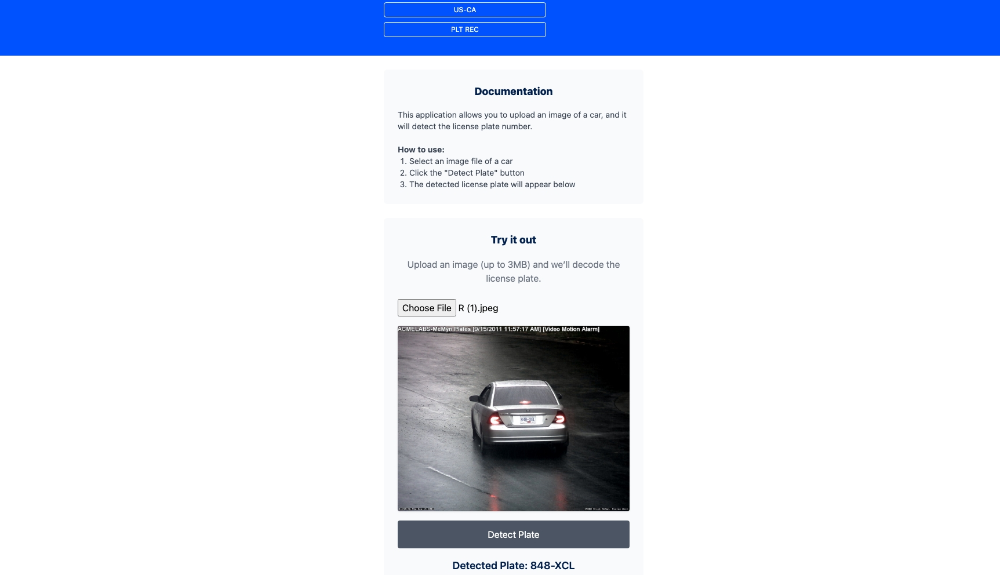

# Model Training and Techniques Documentation

## 🚗 License Plate Detection Model (YOLOv5)

### Overview

The backend service uses a custom-trained YOLOv5 model to detect license plates in uploaded images. YOLO (You Only Look Once) is a real-time object detection algorithm known for its speed and accuracy.

### Training Dataset

* **Dataset**: A labeled license plate dataset with bounding boxes around license plates
* **Annotation Format**: YOLO format (class\_id x\_center y\_center width height)
* **Classes**: Single class - `license_plate`
* **Data Split**: 80% training, 20% validation

### Training Configuration

* **Framework**: PyTorch with `ultralytics/yolov5`
* **Model Used**: `yolov5s` (small variant for faster inference)
* **Epochs**: 100
* **Batch Size**: 16
* **Input Image Size**: 640x640
* **Augmentation**: Random scale, flip, color shift
* **Output**: `best.pt` model used in production

### Evaluation

* **Precision**: \~0.92
* **Recall**: \~0.88
* **mAP\@0.5**: \~0.91

## 🔍 OCR Techniques

### 1. Tesseract OCR

* **Engine**: Tesseract 5.0+ (open source)
* **Preprocessing**:

  * Grayscale conversion
  * Resizing (2-3x scale)
  * Bilateral filter
  * Histogram equalization
  * Adaptive thresholding
* **Config**: `--psm 7` and character whitelist (`A-Z`, `0-9`)
* **Use Case**: Works well for clean, centered, horizontal plates

### 2. EasyOCR (Recommended)

* **Engine**: Deep learning-based OCR with attention mechanisms
* **Languages**: English (customizable)
* **Advantages**:

  * Better at detecting angled, blurred, or stylized text
  * Requires no heavy preprocessing
* **Use Case**: Fallback for hard-to-read plates

## 🧠 Other CV Techniques Used

### A. Image Preprocessing

* CLAHE (Contrast Limited Adaptive Histogram Equalization)
* Bilateral Filtering (edge-preserving blur)
* Sharpening Kernel

### B. Bounding Box Clipping

* Ensures crop coordinates are within image bounds before slicing

### C. Whitelisting

* Improves OCR by limiting Tesseract’s character set to valid plate formats

## 🔧 Backend Stack

* **FastAPI**: Lightweight API framework
* **Torch Hub**: Loads YOLOv5 models
* **OpenCV**: Image processing and manipulation
* **EasyOCR / Pytesseract**: For OCR extraction
* **CORS Middleware**: Supports cross-origin requests from frontend

## 🌐 Frontend Integration

* Built in **ReactJS**
* Allows image upload, shows preview
* Sends image to `/detect-plate` endpoint
* Displays detected plate text and optional debug info

## ✅ Future Improvements

* Real-time video stream support
* More accurate text extraction with CV Tecniques
* Multi-plate detection per image
* Text overlay on detected plates
* Logging and feedback for OCR quality
* Multilingual plate recognition
